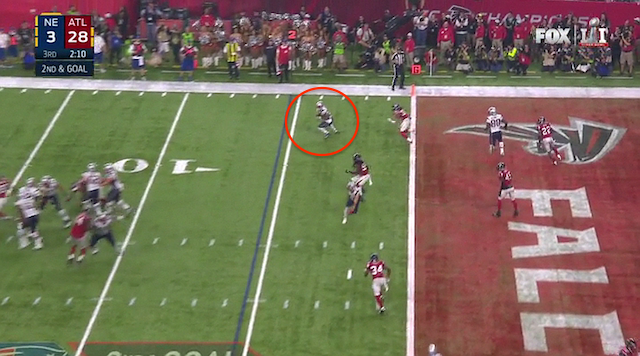

# Live Bitcoin Betting is an application that allows users to bet on sports games in a decentralized fashion during any live event.

## We are proposing a peer-to-peer live betting protocol 

# Quick start 
    docker-compose up

# The problem 

Live betting today sucks!!! 

UI/UX sucks

You have to deposit crypto into a third party wallet.

High premiums on bets

# The solution 

  - Allow users to make bets person to person.

  - Using a blockchain as an escrow enables these types of bets and eliminates high premiums on bets. 

  - Using a betting protocol on top of LBRY's protocol offers a unique and simple UX.
  
  - LBRYBet is an one stop shop to activly watch sporting events, esports and politcal debates

# Why LBRY needs this built 

  - People need a reason to switch to a dentralized app! Most people don't care/ignorant to censorship occuring.

  - LBRYBet creates an engaging experience and one that cannot be recreated on YouTube. 

  - Greatly increase the utility and volume of the LBRY Credit

# Betting Protocol 

## Phase 1 
### Bet announcement (bet host)
      - A user will announce a bet proposal to the the network.
      - Submit a blob to the lbry network containing 
        - Game
        - Team
        - Spread
        - Wager

## Phase 2
### Bet acceptance (bet client)
      - A user will accept a wager by indicating the blob hash
## Phase 3 
### LBRYBet create 2 of 3 multisig escrow
      - LBRYBet service will create a 2 of 3 multisig escrow with our pub key, clent1's and client2's.

## Phase 4
### Bet Host funds escrow
      - Client1 will send DOUBLE the wager to escrow with a time limit
## Phase 5
### Bet client funds escrow
      - Client2 sends DOUBLE the wager to escrow within set time limit

## Phase 6 
### Game finishes and the escrow is signed over to winner
      - Loser of the game resigns and signs the multisig wallet to send the wager to the winner.  
      - If loser does not resign both parties need to wait for LBRYBet to sign the tx to the winner. 

## Misc ideas

- Proof of comment 
    - use commentors as a source of truth to solve oracle problem.  The idea would be that a commenter would be able to stake       their lbry credits to vote on the outcome of the game.  Staking will lead to a small reward when voting correctly and         severe penalty for voting wrong. 

## Future Implmentations
- Live Chat
    - All users watching the same game will have the opportunity to live chat with each other. 
- Bets via SMS
    - Users will be able to place and accept bets by simply sending a text message. 
 
  
